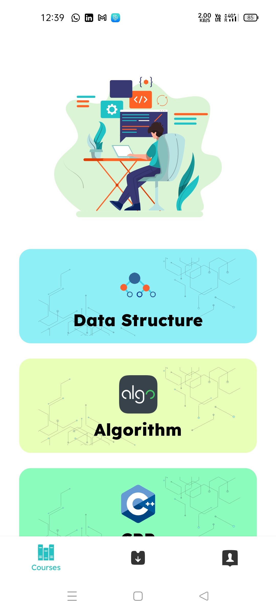

# Android-Study-Jams

Edu-Digital-The-online-library

<b> Problem Statement: </b>

In this world of the Internet with a lot and lot of content and courses to learn it had become very difficult to identify the good resources especially to the 1st year students who are new to programming 

<b> Proposed Solution : </b>

In this project, we have tried to identify some good resources for learning some of the general programming skills like Data Structures, Algorithms, Cpp, Java and provided that in the android app so that anyone can easily learn by reading blogs, pdfs or by watching videos, provided some best questions topic wise to practice for those who want to master their skills by small some good questions.

# 

    	  	
<b> Functionality & Concepts used : </b>

- The App has a very simple and interactive interface which helps the students select their language and learn data structure and algorithms and the programming language which they want to learn with the one of the best resources. Following are few android concepts used to achieve the functionalities in app : 
- Jetpack Navigation is used to navigate between different screens and in bottom navigation bar.
- RecyclerView : To present the list of available courses to learn through this app in courses screen and for presenting questions in question screen.
- Getting data from Internet in background thread using "Coroutines".
- Firebase Remote config to be able to change data without giving an update to the user.
- LiveData & ViewModel : We are also using LiveData to update & observe any changes in the content displayed in the app.

<b> Application Link & Future Scope : </b>

The app is currently in the testing phase, You will be able to access the app soon as it will be uploaded on the playstore : You can still check out <a href="https://github.com/GDSC-BIT-Sindri/EduDigital/raw/main/app/app-release.apk">here.</a>

We are planning to give support for more languages like python and for more technologies like Android development, machine learning, etc
and working to make that user freindly so that any user can add the questions they feel good this will make a good community,
Contents will be updated and new resources will be added to learn that
